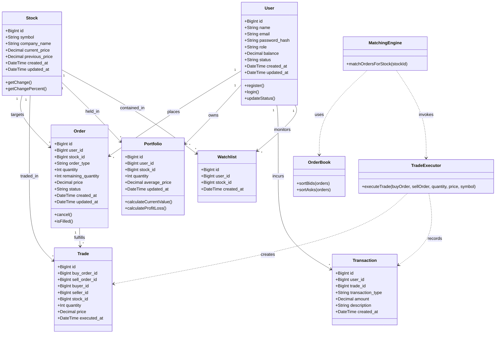

# Class Diagram - Virtual Stock Exchange Object Model

```mermaid
classDiagram
    class User {
        +BigInt id
        +String name
        +String email
        +String password_hash
        +String role
        +Decimal balance
        +String status
        +DateTime created_at
        +DateTime updated_at
        +register()
        +login()
        +updateStatus()
    }

    class Stock {
        +BigInt id
        +String symbol
        +String company_name
        +Decimal current_price
        +Decimal previous_price
        +DateTime created_at
        +DateTime updated_at
        +getChange()
        +getChangePercent()
    }

    class Order {
        +BigInt id
        +BigInt user_id
        +BigInt stock_id
        +String order_type
        +Int quantity
        +Int remaining_quantity
        +Decimal price
        +String status
        +DateTime created_at
        +DateTime updated_at
        +cancel()
        +isFilled()
    }

    class Trade {
        +BigInt id
        +BigInt buy_order_id
        +BigInt sell_order_id
        +BigInt buyer_id
        +BigInt seller_id
        +BigInt stock_id
        +Int quantity
        +Decimal price
        +DateTime executed_at
    }

    class Portfolio {
        +BigInt id
        +BigInt user_id
        +BigInt stock_id
        +Int quantity
        +Decimal average_price
        +DateTime updated_at
        +calculateCurrentValue()
        +calculateProfitLoss()
    }

    class Transaction {
        +BigInt id
        +BigInt user_id
        +BigInt trade_id
        +String transaction_type
        +Decimal amount
        +String description
        +DateTime created_at
    }

    class Watchlist {
        +BigInt id
        +BigInt user_id
        +BigInt stock_id
        +DateTime created_at
    }

    class MatchingEngine {
        +matchOrdersForStock(stockId)
    }

    class OrderBook {
        +sortBids(orders)
        +sortAsks(orders)
    }

    class TradeExecutor {
        +executeTrade(buyOrder, sellOrder, quantity, price, symbol)
    }

    User "1" --> "*" Order : places
    User "1" --> "*" Portfolio : owns
    User "1" --> "*" Transaction : incurs
    User "1" --> "*" Watchlist : monitors
    Stock "1" --> "*" Order : targets
    Stock "1" --> "*" Trade : traded_in
    Stock "1" --> "*" Portfolio : held_in
    Stock "1" --> "*" Watchlist : contained_in
    Order "1" --> "*" Trade : fulfills
    MatchingEngine ..> OrderBook : uses
    MatchingEngine ..> TradeExecutor : invokes
    TradeExecutor ..> Trade : creates
    TradeExecutor ..> Transaction : records
```
