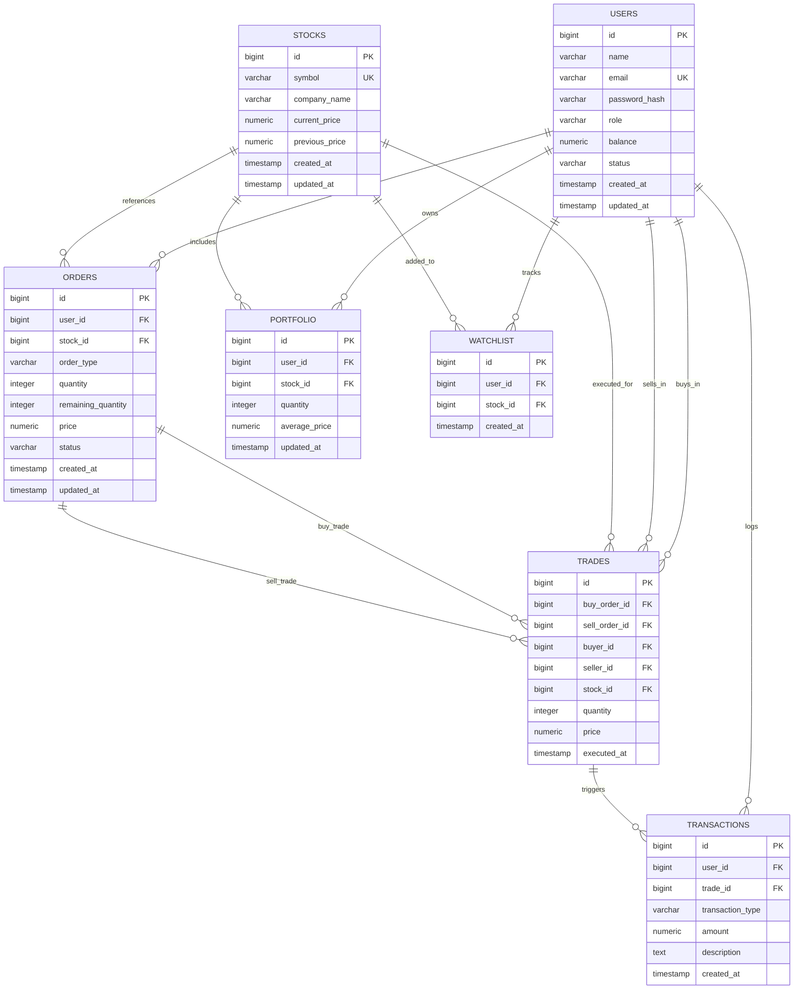

# Entity-Relationship (ER) Diagram

```mermaid
erDiagram
    USERS ||--o{ ORDERS : places
    USERS ||--o{ PORTFOLIO : owns
    USERS ||--o{ TRANSACTIONS : logs
    USERS ||--o{ WATCHLIST : tracks
    USERS ||--o{ TRADES : buys_in
    USERS ||--o{ TRADES : sells_in

    STOCKS ||--o{ ORDERS : references
    STOCKS ||--o{ PORTFOLIO : includes
    STOCKS ||--o{ WATCHLIST : added_to
    STOCKS ||--o{ TRADES : executed_for

    ORDERS ||--o{ TRADES : buy_trade
    ORDERS ||--o{ TRADES : sell_trade

    TRADES ||--o{ TRANSACTIONS : triggers

    USERS {
        bigint id PK
        varchar name
        varchar email UK
        varchar password_hash
        varchar role
        numeric balance
        varchar status
        timestamp created_at
        timestamp updated_at
    }

    STOCKS {
        bigint id PK
        varchar symbol UK
        varchar company_name
        numeric current_price
        numeric previous_price
        timestamp created_at
        timestamp updated_at
    }

    ORDERS {
        bigint id PK
        bigint user_id FK
        bigint stock_id FK
        varchar order_type
        integer quantity
        integer remaining_quantity
        numeric price
        varchar status
        timestamp created_at
        timestamp updated_at
    }

    TRADES {
        bigint id PK
        bigint buy_order_id FK
        bigint sell_order_id FK
        bigint buyer_id FK
        bigint seller_id FK
        bigint stock_id FK
        integer quantity
        numeric price
        timestamp executed_at
    }

    PORTFOLIO {
        bigint id PK
        bigint user_id FK
        bigint stock_id FK
        integer quantity
        numeric average_price
        timestamp updated_at
    }

    TRANSACTIONS {
        bigint id PK
        bigint user_id FK
        bigint trade_id FK
        varchar transaction_type
        numeric amount
        text description
        timestamp created_at
    }

    WATCHLIST {
        bigint id PK
        bigint user_id FK
        bigint stock_id FK
        timestamp created_at
    }
```
