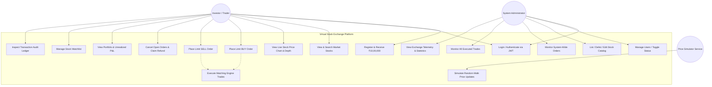

# Use Case Diagram - Virtual Stock Exchange & Trading System

```mermaid
graph TD
    Investor((Investor / Trader))
    Admin((System Administrator))
    PriceService((Price Simulator Service))

    subgraph "Virtual Stock Exchange Platform"
        UC1[Register & Receive ₹10,00,000]
        UC2[Login / Authenticate via JWT]
        UC3[View & Search Market Stocks]
        UC4[View Live Stock Price Chart & Depth]
        UC5[Place Limit BUY Order]
        UC6[Place Limit SELL Order]
        UC7[Cancel Open Orders & Claim Refund]
        UC8[View Portfolio & Unrealized P&L]
        UC9[Manage Stock Watchlist]
        UC10[Inspect Transaction Audit Ledger]

        UC11[Manage Users / Toggle Status]
        UC12[List / Delist / Edit Stock Catalog]
        UC13[Monitor System-Wide Orders]
        UC14[Monitor All Executed Trades]
        UC15[View Exchange Telemetry & Statistics]

        UC16[Simulate Random-Walk Price Updates]
        UC17[Execute Matching Engine Trades]
    end

    Investor --> UC1
    Investor --> UC2
    Investor --> UC3
    Investor --> UC4
    Investor --> UC5
    Investor --> UC6
    Investor --> UC7
    Investor --> UC8
    Investor --> UC9
    Investor --> UC10

    Admin --> UC2
    Admin --> UC11
    Admin --> UC12
    Admin --> UC13
    Admin --> UC14
    Admin --> UC15

    PriceService --> UC16
    UC5 -.-> UC17
    UC6 -.-> UC17
```
